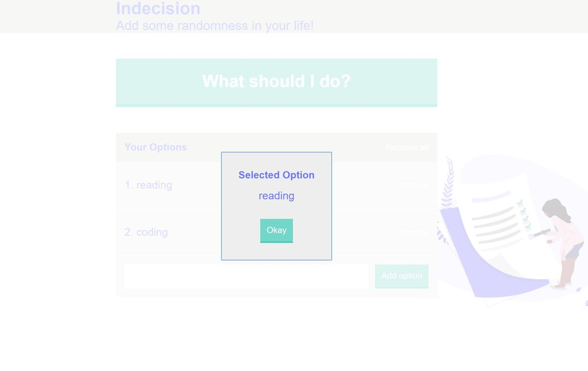

# 🤷 indecision-app

**indecision-app** is an app built with React, Sass and Webpack.

## Installation

Clone the project and use the package manager npm to install indecision-app and its dependencies.

## Usage

  
* New items can be added into the list.
* Items can be deleted individually.
* The list of items can be cleared.
* An item is picked randomly and displayed in a modal window when the big green button is clicked.

## Contributing
To do:
- [ ] add a feature to modify an item in the list

## License
[MIT](https://choosealicense.com/licenses/mit/)